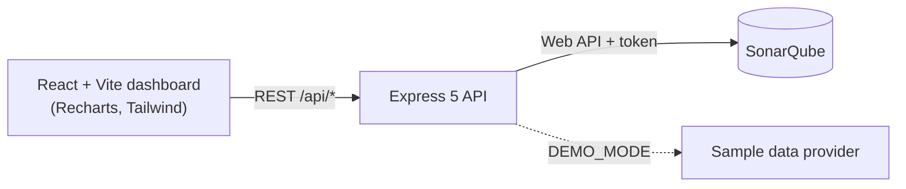

# Code Quality Analyzer

A full-stack dashboard that turns raw **SonarQube** static-analysis results into something a team can act on: letter grades, threshold alerts, issue triage and quality trends over time.

[](https://github.com/samrender-tech/Code-Quality/actions/workflows/ci.yml)


SonarQube's own UI is built for engineers digging into individual rules. This project answers the questions a lead or reviewer asks first: *Is this project healthy? Is it getting better or worse? What should we fix first?*

## Features

- **Project health at a glance**: bugs, vulnerabilities, code smells, coverage, duplication and lines of code, with SonarQube's reliability, security and maintainability ratings shown as A–E.
- **Grading model**: each metric gets an A/B/C grade, and the overall grade is the worst of them. Projects without a coverage report are not penalised.
- **Configurable alerts**: banners appear when bugs or vulnerabilities pass your thresholds, or when the quality gate fails.
- **Quality trend**: bugs, vulnerabilities and code smells across past analyses, from SonarQube's measure history.
- **Issue explorer**: paginated issue list, filterable by type and severity, with rule keys and file locations.
- **Demo mode**: runs on built-in sample data, so anyone can try the dashboard without installing SonarQube.
- **Safe by design**: the SonarQube token stays on the server. The browser only talks to this project's API.

## Architecture



The API sits between the browser and SonarQube for three reasons: the token never reaches the browser, SonarQube's responses are reshaped into the small payloads the UI needs, and the data source is swappable. The real SonarQube client and the demo provider implement the same interface, so routes and tests don't care which one is active.

| Layer | Stack |
| --- | --- |
| Frontend | React 19, React Router 7, Recharts 3, Tailwind CSS 3, Axios, Vite 8 |
| Backend | Node.js 20+, Express 5, Axios |
| Analysis engine | SonarQube Community Edition (Docker) |
| Quality | Node's built-in test runner, ESLint, GitHub Actions CI |

## Quick start (demo mode, no SonarQube needed)

Requires Node.js 20.19+ or 22.12+.

```bash
git clone https://github.com/samrender-tech/Code-Quality.git
cd Code-Quality
npm run setup          # installs backend and frontend dependencies
```

Then, in two terminals:

```bash
npm run api:demo       # API on http://localhost:4000 with sample data
npm run web            # dashboard on http://localhost:5173
```

Open http://localhost:5173 and switch between the three sample projects.

## Running against a real SonarQube

1. **Start SonarQube** (needs Docker):

   ```bash
   docker compose up -d
   ```

   Open http://localhost:9000, log in with `admin` / `admin` and set a new password.

2. **Create a token**: My Account → Security → Generate Token.

3. **Configure the API**:

   ```bash
   cp backend/.env.example backend/.env
   ```

   Set `SONARQUBE_TOKEN` in `backend/.env` (leave `DEMO_MODE=false`).

4. **Analyze something.** To try it on the bundled sample project, see [`examples/sample-project`](examples/sample-project). For your own code, run the [SonarScanner](https://docs.sonarsource.com/sonarqube-server/latest/analyzing-source-code/scanners/sonarscanner/) in its folder.

5. **Run the app**: `npm run api` and `npm run web`, then pick your project in the selector.

## Configuration

`backend/.env`:

| Variable | Default | Purpose |
| --- | --- | --- |
| `DEMO_MODE` | `false` | `true` serves sample data instead of calling SonarQube |
| `SONARQUBE_URL` | `http://localhost:9000` | SonarQube server address |
| `SONARQUBE_TOKEN` | – | SonarQube user token |
| `PORT` | `4000` | API port |
| `CORS_ORIGIN` | `http://localhost:5173` | Allowed browser origins (comma-separated, or `*`) |

`frontend/.env` (optional): `VITE_API_URL` points the dashboard at a different API address.

## API

All endpoints return JSON. Errors always have the shape `{ "error": "message" }`.

| Method & path | Description |
| --- | --- |
| `GET /health` | Liveness check, including the active data mode |
| `GET /api/projects` | Projects the token can access (admin tokens also get last-analysis dates) |
| `GET /api/projects/status` | Whether SonarQube is reachable, and its version |
| `GET /api/measures?projectKey=` | Current metrics as a flat `{ metric: value }` map. Optional `metrics=a,b` |
| `GET /api/measures/history?projectKey=` | Bugs, vulnerabilities and code smells per past analysis, oldest first |
| `GET /api/issues?projectKey=` | Issues, with optional `types`, `severities`, `statuses`, `p` (page) and `ps` (page size, max 500) |

SonarQube failures are translated into clear responses: an unreachable server becomes `502`, a rejected token becomes `401` with a hint, and SonarQube's own error messages are passed through.

## Grading model

| Metric | A | B | C |
| --- | --- | --- | --- |
| Bugs | 0 | 1–5 | more than 5 |
| Vulnerabilities | 0 | 1–2 | more than 2 |
| Code smells | 0–10 | 11–50 | more than 50 |
| Coverage | 80% or more | 50–79% | under 50% |

The overall grade is the worst individual grade. Alert thresholds are set per browser on the Settings page.

## Project structure

```
.
├── backend/
│   ├── src/
│   │   ├── app.js              Express app factory (used by the server and the tests)
│   │   ├── server.js           Entry point: picks SonarQube or demo data and starts listening
│   │   ├── config.js           Environment configuration
│   │   ├── routes/             projects, measures, issues
│   │   ├── services/           sonarqube.js (real client), demo.js (sample data)
│   │   └── middleware/         error handling and request validation
│   └── test/                   API tests
├── frontend/
│   └── src/
│       ├── pages/              Dashboard, Issues, Settings
│       ├── components/         cards, badges, alerts, charts
│       ├── hooks/useApi.js     data fetching with loading, error and stale-response handling
│       ├── services/api.js     API client
│       └── utils/              grading, alerts, thresholds (with unit tests)
├── examples/sample-project/    small project with deliberate issues to scan
├── docker-compose.yml          local SonarQube
└── .github/workflows/ci.yml    tests, lint and build on every push
```

## Testing

```bash
npm test               # backend API tests + frontend unit tests
npm run lint           # ESLint on the frontend
npm run build          # production build of the dashboard
```

The backend tests start the real Express app on a random port against the demo provider, and also check how SonarQube failures are reported. The same checks run in GitHub Actions on every push and pull request.

## Roadmap

- Compare two projects side by side
- Export a project report as PDF
- Pull-request decoration: post the grade as a GitHub check

## License

[MIT](LICENSE)
